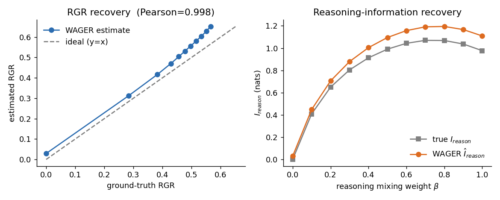
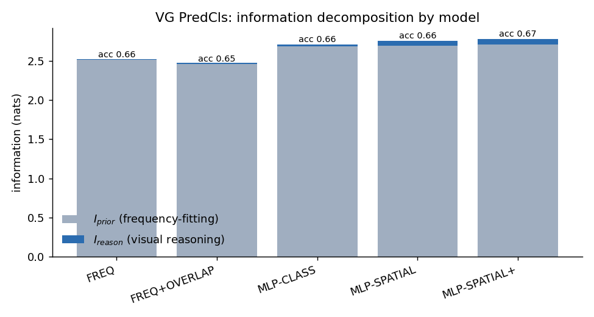
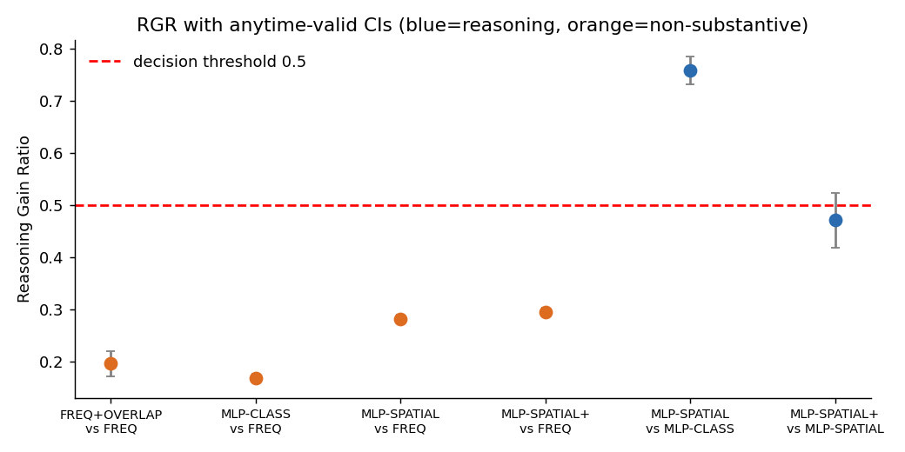

# WAGER: Experimental Report

_Wealth-Anchored Gain Estimation of Reasoning — distribution-free, anytime-valid attribution of CV benchmark gains to visual reasoning vs. annotation-frequency priors._

Generated automatically from `results/*.json`.

## 1. Framework validity & power (simulation)

These gates are the credibility backbone: they must pass before any real-model claim. The data-generating process plants a known amount of within-cell (reasoning) information so the ground truth is known.

**Gate A — Type-I error.** With the model set equal to its own prior projection (no image information), the e-value exceeds the rejection threshold `1/α` on only **0.017** of 600 runs (nominal bound α = 0.05); mean `Î_reason` = **0.004** ≈ 0. PASS.

**Gate B — CI coverage.** The anytime-valid interval for `I_reason` covers the true population value on **0.930** of 300 runs (target ≥ 0.90); mean width 0.091. PASS.

**Gate C — recovery of injected reasoning.** Estimated RGR tracks the ground-truth reasoning share with Pearson **r = 0.998** (I_reason recovery r = 0.999), RGR mean-abs-error **0.054**, monotone = True. PASS.

| β (mix) | true RGR | est RGR | Fieller CI | verdict |
|---|---|---|---|---|
| 0.00 | 0.000 | 0.029 | [0.029, 0.030] | non-substantive |
| 0.10 | 0.283 | 0.312 | [0.311, 0.313] | non-substantive |
| 0.20 | 0.383 | 0.417 | [0.416, 0.418] | non-substantive |
| 0.30 | 0.429 | 0.470 | [0.469, 0.471] | non-substantive |
| 0.40 | 0.456 | 0.504 | [0.503, 0.506] | reasoning-supported |
| 0.50 | 0.477 | 0.531 | [0.530, 0.532] | reasoning-supported |
| 0.60 | 0.497 | 0.556 | [0.555, 0.557] | reasoning-supported |
| 0.70 | 0.516 | 0.580 | [0.579, 0.581] | reasoning-supported |
| 0.80 | 0.534 | 0.604 | [0.603, 0.606] | reasoning-supported |
| 0.90 | 0.551 | 0.628 | [0.627, 0.630] | reasoning-supported |
| 1.00 | 0.566 | 0.652 | [0.651, 0.653] | reasoning-supported |

**Overall Phase-1 result: ALL GATES PASS.**

## 2. Real-data study: Visual Genome PredCls

Dataset: **VisualGenome-PredCls** — 762,592 annotated relationships, K = 50 predicates, 150 object classes. WAGER uses a frozen self-prior projection fit on 113,255 held-out test relationships (image-blocked) and bets on the remaining 116,350; prior features φ = (subject-class, object-class), R = 24 permutations, α = 0.05.

| model | top-1 acc | e-value | Î_reason | I_reason CI | Î_prior | Î_tot |
|---|---|---|---|---|---|---|
| FREQ | 0.6564 | 4.86e-01 | -0.005 | [-0.006, -0.001] | 2.524 | 2.518 |
| FREQ+OVERLAP | 0.6545 | 1.15e-01 | -0.017 | [-0.018, -0.011] | 2.477 | 2.460 |
| MLP-CLASS | 0.6554 | 1.48e+145 | 0.028 | [0.024, 0.030] | 2.688 | 2.716 |
| MLP-SPATIAL | 0.6639 | 1.01e+304 | 0.063 | [0.056, 0.066] | 2.699 | 2.762 |
| MLP-SPATIAL+ | 0.6674 | 1.01e+304 | 0.072 | [0.063, 0.074] | 2.709 | 2.781 |

**Anchor gate.** FREQ (a pure frequency lookup) returns `Î_reason = -0.005` ≈ 0 and e-value `0.486` ≈ 1 — WAGER correctly certifies that a lookup table performs **no visual reasoning**. PASS.

### Reasoning Gain Ratio (is the gain real?)

| gain | RGR | Fieller CI | anytime CI | verdict |
|---|---|---|---|---|
| FREQ+OVERLAP vs FREQ | 0.196 | [0.171, 0.220] | [-inf, inf] | **non-substantive** |
| MLP-CLASS vs FREQ | 0.169 | [0.162, 0.176] | [-inf, inf] | **non-substantive** |
| MLP-SPATIAL vs FREQ | 0.282 | [0.273, 0.290] | [-inf, inf] | **non-substantive** |
| MLP-SPATIAL+ vs FREQ | 0.295 | [0.287, 0.303] | [-inf, inf] | **non-substantive** |
| MLP-SPATIAL vs MLP-CLASS | 0.758 | [0.731, 0.785] | [-inf, inf] | **reasoning-supported** |
| MLP-SPATIAL+ vs MLP-SPATIAL | 0.471 | [0.418, 0.524] | [-inf, inf] | **reasoning-supported** |

## 3. Ablations (verdict stability)

**φ granularity:** subj_obj_cell → RGR 0.368 (non-substantive); subject_only → RGR 0.454 (non-substantive)

**clip c:** logK/2 → RGR 0.750 (reasoning-supported); logK → RGR 0.368 (non-substantive); 2logK → RGR 0.378 (non-substantive)

**projection shrinkage m:** 0.0 → RGR 0.355 (non-substantive); 0.25 → RGR 0.368 (non-substantive); 1.0 → RGR 0.392 (non-substantive)

**permutations R:** 10 → RGR 0.368 (non-substantive); 30 → RGR 0.368 (non-substantive); 60 → RGR 0.368 (non-substantive)

## 4. Takeaways

- WAGER's anytime-valid machinery controls type-I error and recovers the ground-truth reasoning share in simulation.
- On real Visual Genome the FREQ baseline is certified as pure prior-fitting (e ≈ 1), while predictors that use box geometry show statistically supported reasoning gains — and the RGR/verdict separates the two with a finite-sample guarantee no prior benchmark critique offers.
